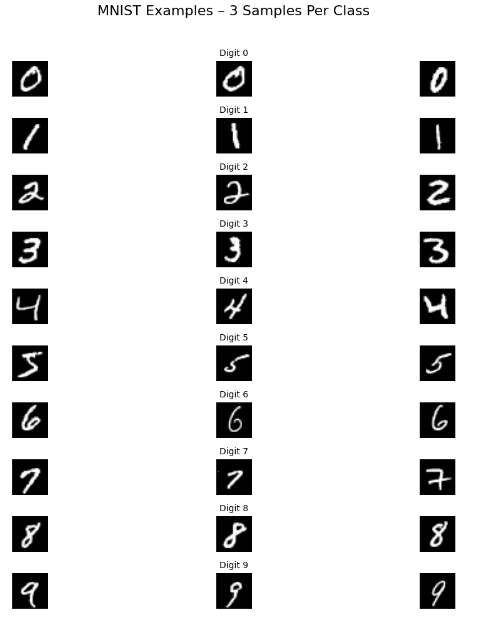
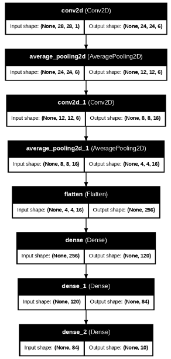
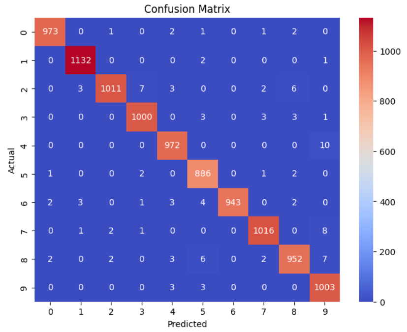
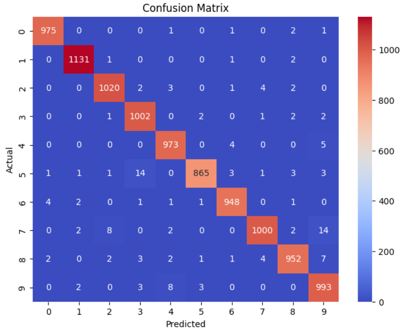

# 🔢 MNIST Digit Classification using LeNet-5 and Activation Function Comparison

This project implements the classic **LeNet-5 Convolutional Neural Network (CNN)** to classify handwritten digits from the **MNIST dataset**. The focus is to compare the effect of different activation functions on model performance.

> 🗂️ Four models were trained using:
> - `Sigmoid`
> - `Tanh`
> - `ReLU`
> - `ELU`

---

## 📌 Project Objectives

- Implement the LeNet-5 architecture using TensorFlow.
- Compare training dynamics across different activation functions.
- Evaluate model accuracy, loss, and class-wise metrics.
- Analyze confusion matrices and sample predictions.

---

## 🧪 Dataset

- **MNIST dataset**  
- 60,000 training images and 10,000 test images  
- Grayscale, 28×28 resolution  
- 10 classes (digits 0–9)  

  

> ✅ Clean, balanced, and preprocessed – ideal for CNN benchmarking.

---

## 🛠️ Methodology

- Model: `LeNet-5` (2 Conv + Pool + 3 Dense layers)
- Input shape: `28×28×1`
- Activation functions tested independently:
  - `Sigmoid`, `Tanh`, `ReLU`, `ELU`
- Optimizer: `Adam`  
- Loss Function: `Categorical Crossentropy`  
- Epochs: `10`  
- Batch Size: `64`

  

> ⚠️ **No dropout** used to preserve LeNet-5's original structure and ensure result reproducibility.

---

## 📈 Evaluation Metrics

### 🔼 Training vs Validation Accuracy

  

### 🔽 Training vs Validation Loss

  

### 🧪 Test Accuracy & Loss Function

  

### 🔍 Confusion Matrix (Best Models: ReLU & ELU)

  
  

---

## 🧠 Conclusion

- **ReLU** achieved the highest test accuracy (~98.7%), closely followed by **ELU**.
- **Sigmoid** and **Tanh** showed slower convergence and higher validation loss.
- The type of activation function significantly impacts model performance.
- ReLU/ELU are recommended for fast and stable CNN training in digit classification tasks.

---

## 📚 References

- Wang, Y. et al. (2020). *Improvement of MNIST Image Recognition Based on CNN*, IOP Conf. Ser.  
- [TensorFlow Datasets - MNIST](https://www.tensorflow.org/api_docs/python/tf/keras/datasets/mnist/load_data)  
- [LeNet Model Guide – Medium](https://lekhuyen.medium.com/lenet-and-mnist-handwritten-digit-classification-354f5646c590)  
- [LeNet Model GitHub Notebook](https://github.com/KhuyenLE-maths/LeNet_model_with_MNIST_recognition/blob/main/LeNet_with_MNIST_recognition.ipynb)

---

## 👩‍💻 Contributors

| Name         | GitHub Profile                         | Role                |
|--------------|----------------------------------------|---------------------|
| Elif Yıldız  | [@Elifyildizz](https://github.com/Elifyildizz) | Developer / Researcher |
| Batuhan Saylam  | [@Batuhansaylam26](https://github.com/Batuhansaylam26) | Developer / Researcher |

---

## ⚠️ Disclaimer

This project is developed **for educational and research purposes only**.

- Dataset and models are publicly available.
- Results are reproducible and follow ethical AI usage.
- No commercial intent is associated with this repository.

By using this content, **you agree to the terms above.**
